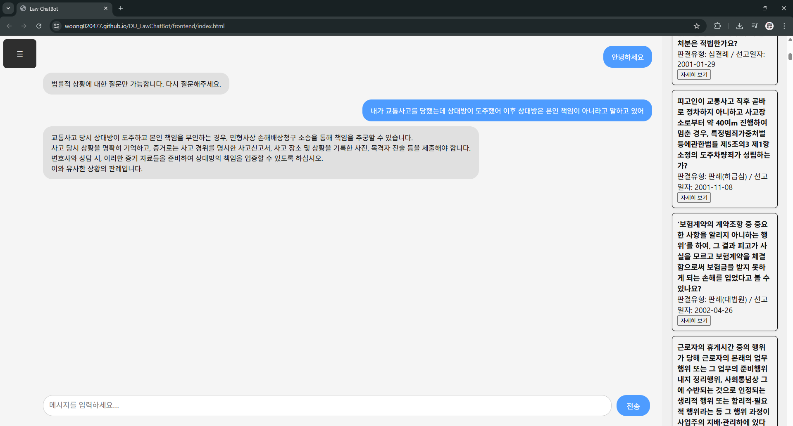
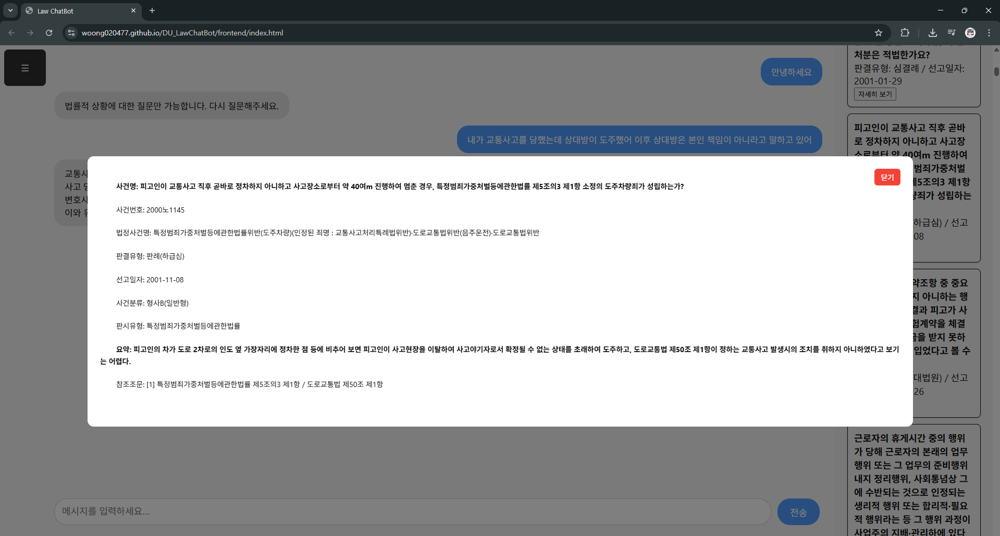

 
<h1>DU_LawChatBot</h1>
<h2>Information</h2>

법률적인 상황에 대한 채팅을 통해 가이드라인을 제시하고, 유사한 판례를 제공하는 웹 서비스입니다. 

 

 

<h2>How To Use</h2>
<h3>Client</h3>
1. 서버 실행 
2. <a href = "https://woong020477.github.io/DU_LawChatBot/frontend/index.html">https://woong020477.github.io/DU_LawChatBot/frontend/index.html</a> 접속 
2-1. 혹은 해당 프로젝트 frontend 폴더 내의 index.html 실행 

<h3>Server</h3>
1. <a href = "https://nodejs.org/ko/download">Node.js 공식 사이트</a> 접속하여 Node.js 설치 
2. 프로젝트를 클론 혹은 다운로드 받은 후 backend 폴더 진입 
3. 해당 폴더에 ".env" 이름으로 파일을 생성 
4. .env 첫 번째 줄에 OPENAI_API_KEY="OpenAI GPT API에서 발급받은 키" 작성 
5. 명령프롬프트 혹은 터미널을 열어 backend 폴더 진입
3. "node server.js" 입력 (Ctrl + C 혹은 창 닫기 버튼으로 종료 가능) 

<h2>Wiki</h2>
<a href = "https://github.com/woong020477/DU_LawChatBot/wiki">해당 프로젝트에 관한 위키 주소</a> 
